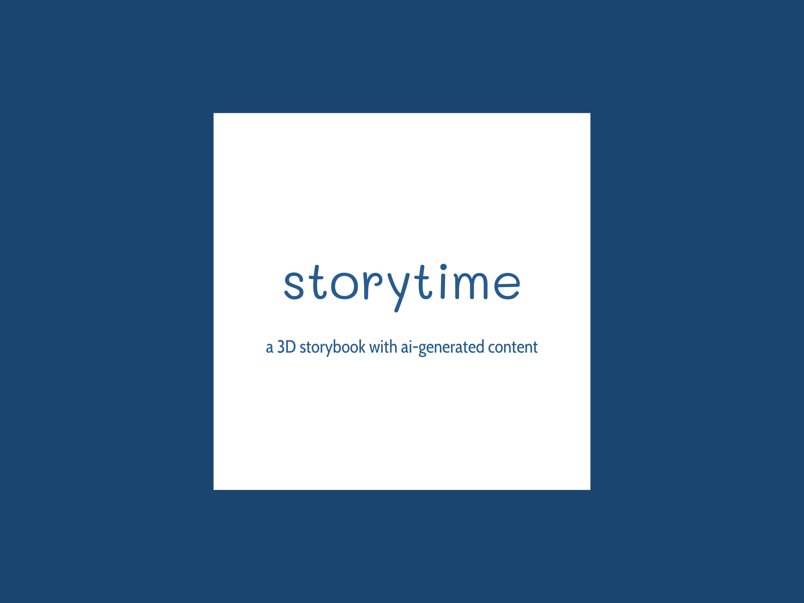
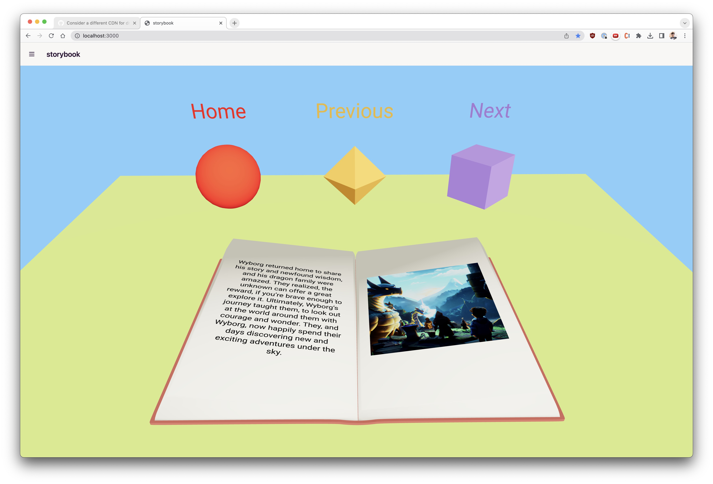

<!-- # storybook -->
<!-- An AI-generated storybook creation application  -->

<a name="readme-top"></a>

[![Forks][forks-shield]][forks-url]
[![Stargazers][stars-shield]][stars-url]
[![Issues][issues-shield]][issues-url]
[![MIT License][license-shield]][license-url]
[![LinkedIn][linkedin-shield]][linkedin-url]

<!-- PROJECT LOGO -->
<br />
<div align="center">
  <a href="https://github.com/d-hp/storybook-ai-rf3">
    
  </a>
   <br /> 
   <br /> 
  <p align="center">
  A web application that uses DALL-E & DaVinci OpenAI models to create user-prompted stories rendered using WebGL/RF3  <br />
   <br /> 
    <a href="https://github.com/d-hp/storybook-ai-rf3"><strong>Explore the docs »</strong></a>
    <br />
    <br />
    <a href="https://github.com/d-hp/storybook-ai-rf3">View Demo</a>
    ·
    <a href="https://github.com/d-hp/storybook-ai-rf3/issues">Report Bug</a>
    ·
    <a href="https://github.com/d-hp/storybook-ai-rf3/issues">Request Feature</a>
  </p>
</div>

<br />

<!-- ABOUT THE PROJECT -->
<br />

## About The Project

<br />
  <div align="center">
    
  </div>
<br />

storybook is a simple web application that creates stories using OpenAI's DaVinci & DALL-E models based on selections made by users of the application. The application will put together the text & images, provided by the aforementioned APIs, into a 3D environment created using WebGL, ThreeJS, and React-Fiber.

<p align="right">(<a href="#readme-top">back to top</a>)</p>

### Built With

[![React][React.js]][React-url][![Redux][Redux]][Redux-url][![Webpack][Webpack]][Webpack-url][![TailwindCSS][Tailwind]][Tailwind-url][![Node][Node.js]][Node-url][![Express][Express]][Express-url]

<p align="right">(<a href="#readme-top">back to top</a>)</p>

<!-- GETTING STARTED -->

## Getting Started

This project is still in development. If you'd like to check it out, please follow the instructions below.

<br />

#### STEP 1 — Clone the repository

```sh
git clone https://github.com/d-hp/storybook-ai-rf3
```

<br />

#### STEP 2 — Setup environment variables

<p>Create a .env file at the top level of the project directory with the following contents. The `port` will determine where your web application will be locally hosted. The `OPENAI_API_KEY` must be generated through OpenAI's website in order for any of the text and/or images to load. A single API key from OpenAI can be used to access both of the necessary AI models.

```js
# .env
PORT=
OPENAI_API_KEY=
```

<br />

#### STEP 3 — Start the application! The `npm start` script will start both our frontend and backend interface.

```sh
npm start
```

<br />

#### STEP 4 — Navigate to localhost:PORT to try out the storytime application!

```sh
http://localhost:PORT/
```

<p align="right">(<a href="#readme-top">back to top</a>)</p>

<!-- ROADMAP -->

## Roadmap

- [ ] Create more prompt options on the 'Home' page to allow for a greater diversity of stories
- [ ] Persist AI-generated stories by utilizing S3
- [ ] Create testing suites to ensure functionality during development
  - [ ] Unit tests
  - [ ] Integration tests
  - [ ] End-to-end tests

See the [open issues](https://github.com/d-hp/storybook-ai-rf3/issues) for a full list of proposed features (and known issues).

<p align="right">(<a href="#readme-top">back to top</a>)</p>

<!-- LICENSE -->

## License

Distributed under the MIT License. See `LICENSE.txt` for more information.

<p align="right">(<a href="#readme-top">back to top</a>)</p>

## Show your support

Give a ⭐️ if this project helped you!

[forks-shield]: https://img.shields.io/github/forks/d-hp/storybook-ai-rf3.svg?style=for-the-badge
[forks-url]: https://github.com/d-hp/storybook-ai-rf3/network/members
[stars-shield]: https://img.shields.io/github/stars/d-hp/storybook-ai-rf3.svg?style=for-the-badge
[stars-url]: https://github.com/d-hp/storybook-ai-rf3/stargazers
[issues-shield]: https://img.shields.io/github/issues/d-hp/storybook-ai-rf3.svg?style=for-the-badge
[issues-url]: https://github.com/d-hp/storybook-ai-rf3/issues
[license-shield]: https://img.shields.io/github/license/d-hp/storybook-ai-rf3.svg?style=for-the-badge
[license-url]: https://github.com/d-hp/storybook-ai-rf3/main/LICENSE.txt
[linkedin-shield]: https://img.shields.io/badge/-LinkedIn-black.svg?style=for-the-badge&logo=linkedin&colorB=555
[linkedin-url]: https://linkedin.com/in/linkedin_username
[product-screenshot]: images/screenshot.png
[React.js]: https://img.shields.io/badge/React-20232A?style=for-the-badge&logo=react&logoColor=61DAFB
[React-url]: https://reactjs.org/
[Tailwind]: https://img.shields.io/badge/TailwindCSS-DD0031?style=for-the-badge&logo=tailwindcss&logoColor=white
[Tailwind-url]: https://tailwindcss.com/
[Node.js]: https://img.shields.io/badge/Node-4A4A55?style=for-the-badge&logo=nodedotjs&logoColor=FF3E00
[Node-url]: https://nodejs.org/en/
[Express]: https://img.shields.io/badge/Express-FF2D20?style=for-the-badge&logo=express&logoColor=FF3E00
[Express-url]: https://expressjs.com/
[Redux]: https://img.shields.io/badge/RTK-563D7C?style=for-the-badge&logo=redux&logoColor=white
[Redux-url]: https://redux.js.org/
[Webpack]: https://img.shields.io/badge/Webpack-0769AD?style=for-the-badge&logo=webpack&logoColor=white
[Webpack-url]: https://webpack.js.org/guides/getting-started/
